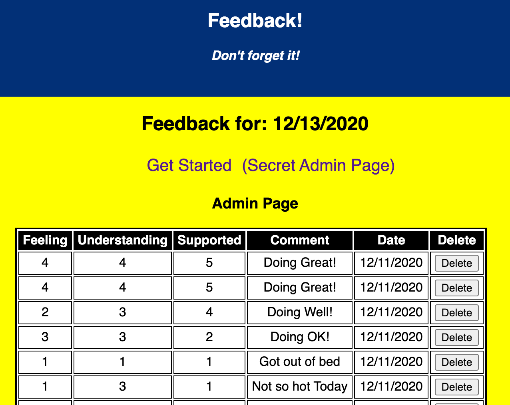

<!--  -->

# Redux Feedback Loop

## Description

_Duration: Weekend Sprint_

This Material-UI enhanced web based 'Feedback' survey tool is a great way to collect daily feedback for institutions, clubs, or the like.  This application features an Admin portal to see all feedback, and remove feedback as necessary.  For demonstration purposes, the Admin poortal is avialable to the user from the main page.  The application collect 3 data points scoring from 1 to 5, and then one verbose comment.   It allows the user to verify the feedback, and return to correct the feedback if they desire.  Finally it allows the user to submit the feedback to the backend database for non-volatile storage.

<!-- To see the fully functional site, please visit: [DEPLOYED VERSION OF APP](https://www.JamesDBird.me) -->

## Screen Shot

`

## Installation

NodeJS and Postgres required.  After the NPM Install, use "npm run server" as well as "npm run client" to start the platform.  Default is port 5000.  Install: PostgreSQL (pg), express.  Database setup file included in root of application files.   Application additionally uses Material-UI

## Usage
Upon starting application, sampole data in the database will be preestablished if you choose to do the database imports.  Enjoy!

## Built With

JQuery
HTML
NodeJS
Express
JavaScript
PostgreSQL
Redux
Material-UI

## Acknowledgement
Thanks to [Prime Digital Academy](www.primeacademy.io) who equipped and helped me to make this application a reality.  Vatti Rocks!

## Support
If you have suggestions or issues, please contact me at www.JamesDBird.com